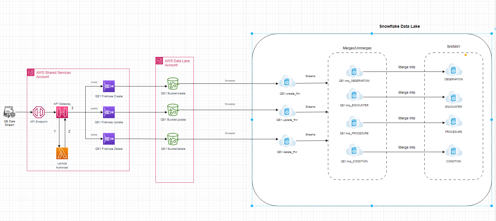

# SHIN-NY IG

## Introduction
“An implementation guide (IG) is a set of rules about how FHIR resources are used to solve a particular problem, 
with associated documentation to support and clarify the usage”.  It also provides documentation about individual 
resource profiles that can be used by FHIR implementers.  The FHIR profiles, that are contained in an IG, 
provide a way to customize resources by allowing one to create use case specific definitions, constraints and/or 
extensions on base resources.

The SHIN-NY IG extends from a limited set of US Core resource profiles to take advantage some of their extensions, 
terminology sets and value set bindings while relaxing many of the cardinality rules and constraints to allow for less 
than ideal data to be able to be transmitted over the wire.  

In its current iteration the SHIN-NY IG only has profiles on the resources below. 
This list will be extended to cover all resources necessary to support all ADT & ORU to FHIR transformations.

- Bundle
- Encounter
- Patient
- Observation
- Condition
- Procedure

---

## Supported REST API Calls

The data lake Rest API will only support the following HTTP methods and routes:

| Route                                 | HTTP Method | Action                                                       |
|---------------------------------------|-------------|--------------------------------------------------------------|
| http://shinny.org/Bundle/             | POST        | Create or Update a resource                                 |
| http://shinny.org/Bundle/:resource_id | DELETE      | DELETE an all existing resources contained in the Bundle     |

The data lake API will *not support* the full set of FHIR routes that are supported by a typical FHIR Server.  

Routes such as the ones below will not be supported:

- _history 
- _validate
- $meta-*
- diff
- graphql

The data lake will not persist any FHIR Bundle resources.  Only the individual FHIR resources contained within the 
Bundle will be persisted.  It is expected that the calling application will always provide a *resource id* 
(FHIR Resource logical id) and that logical id will be used to make any subsequent updates to any FHIR resources.  
It is not expected that a *resource id* is provided in the URI during a POST call by the calling application. 
All *resource ids* in the URI will always be ignored since the Bundle resource is not persisted.   

HTTP method recommendations:
- Always use POST for CREATE & UPDATE operations.
- POST is idempotent. If a request is submitted N times with the SAME resource Id the resources contained will NOT be created N times within the data lake
- The Meta.lastUpdated attribute will be required to ensure FHIR resources get processed in the appropriate order.

If an error occurs during the processing of any HTTP call a FHIR OperationOutcome resource will be returned 
providing detailed information about the outcome of an attempted system operation. 

## High Level Architecture
<!--  -->
<!-- *Data Ingest Workflow* -->

<!-- https://nyehealth.sharepoint.com/:f:/s/Extranet-DataLake/EgOsyaspHcRHrLpTICDpcBgBWCL9p5u0Il1SshhyNNzLOg?e=tr85wZ -->

<!--  -->

*Data Ingest Workflow* 

## SHINNY Data Lake Open API 

<a href="shinny_data_lake_open_api.yaml" download>Click to Download</a>

## API Endpoints
| QE Name                               | ENV | API Endpoint                                                       |
|---------------------------------------|-------------|--------------------------------------------------------------|
|     Bronx RHIO     | DEV        | https://5hlpkcpksa.execute-api.us-east-1.amazonaws.com/dev       |
|     HEALTHeLINK     | DEV        | https://7kf806hh44.execute-api.us-east-1.amazonaws.com/dev       |
|     Healthix     | DEV        | https://u8f4ckrx73.execute-api.us-east-1.amazonaws.com/dev       |
|     HealtheConnections     | DEV        | https://ozr8udz0re.execute-api.us-east-1.amazonaws.com/dev       |
|     Hixny     | DEV        | https://ggexmhfffg.execute-api.us-east-1.amazonaws.com/dev       |
|     Rochester RHIO     | DEV        | https://go2j9ega88.execute-api.us-east-1.amazonaws.com/dev       |

## Release Notes
*Fixes and New Additions*

### June 14th 2023

- Added a SHINNY Data Lake Open API download link to this page
- Changed the Bundle.type to support only *transaction*
- Removed HTTP PUT from the SHINNYHTTPVerbsVS.  Only POST and DELETE are now supported
- Made *Meta* required in the SHINNYObservation & Procedure (this is required for all resources)
- Made *id* required in the SHINNYObservation & Procedure (this is required for all resources)
- Changed SHINNYProcedure.subject reference to SHINNYPatientProfile
- Changed SHINNYProcedure.encounter reference to SHINNYEncounterProfile
- Changed SHINNYDiagnosis.meta to SHINNYMeta
- Changed SHINNYProcedure.recorder to include SHINNYPatientProfile
- Changed SHINNYProcedure.asserter to include SHINNYPatientProfile

### June 16th 2023
- QE API Endpoints were added to this document
- Encounter.episodeOfCare cardinality was changed from 0..1 to 0..*

[//]: # ()
[//]: # (## Gaps )

[//]: # ()
[//]: # (Remaining items to be done:)

[//]: # (- [ ] restrict the following terminology sets to only include)

[//]: # ()
[//]: # (## Suggestions)

[//]: # ()
[//]: # (- Add Pracitioner extensions in all resources such as a Encounter and Condition to allow for nested Practitioner resources instead of references.)